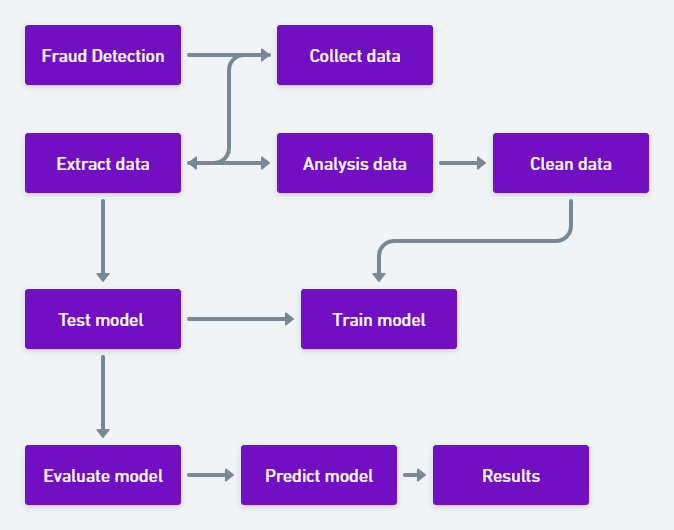

# Fraud_detection
```
The module for Predicting Credit Card Fraud.
Author: Amer Ahmed
Supervisor: Joakim Wassberg
Version 0.0
```

```
The goal for this analysis is to predict credit card fraud in the transactional data.
Iam using tensorflow to build the predictive model, and t-SNE to visualize the dataset
in two dimensions at the end of this analysis.The sections of this analysis include
``` 

 - Exploring the Data
 - Building the Neural Network 
 - Visualizing the Data with t-SNE.


## Fraud detection

```Fraud detection
```



